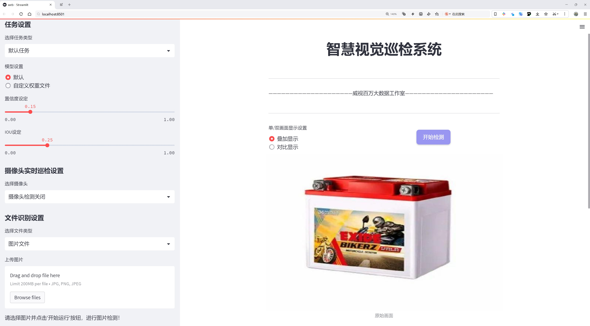
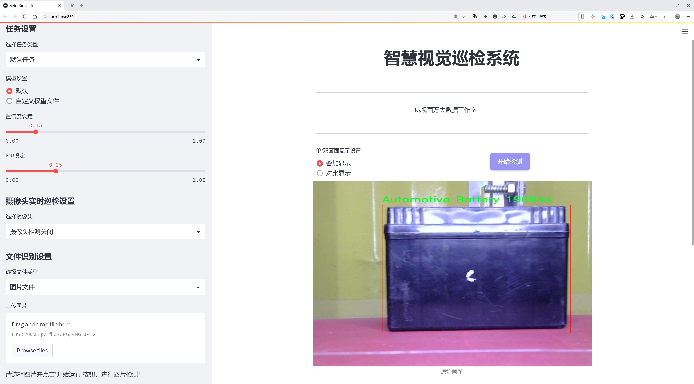
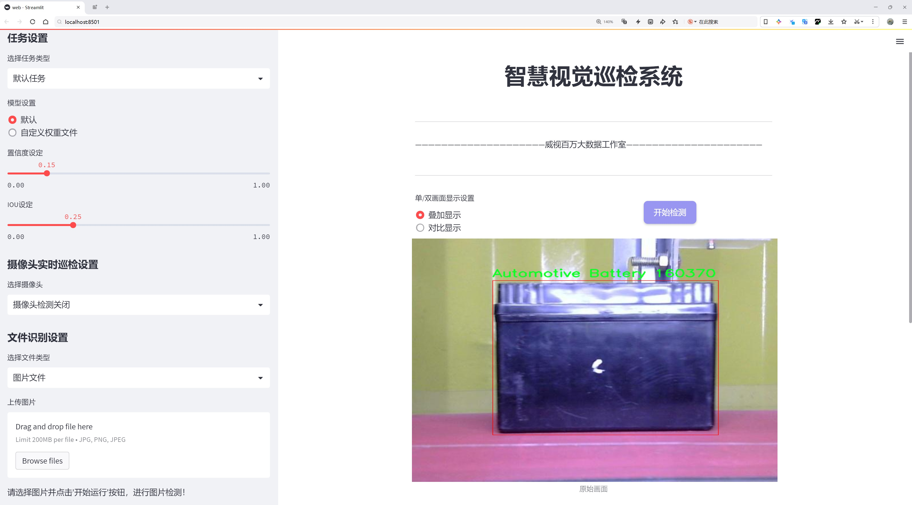
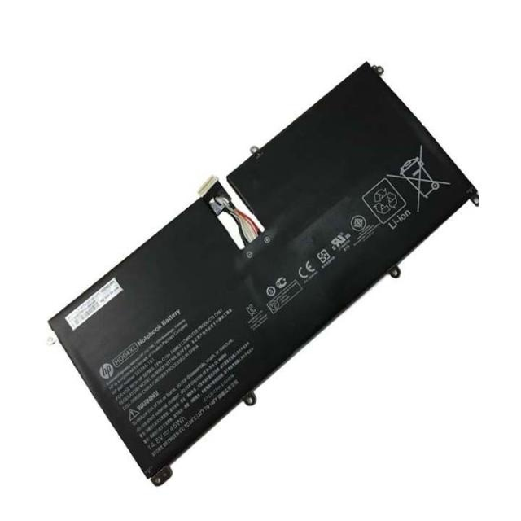
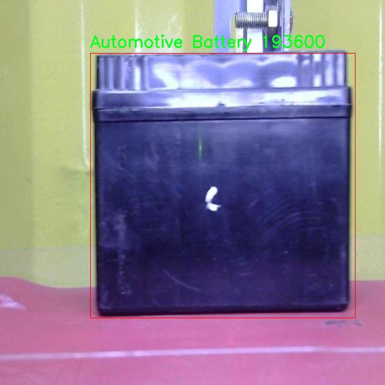
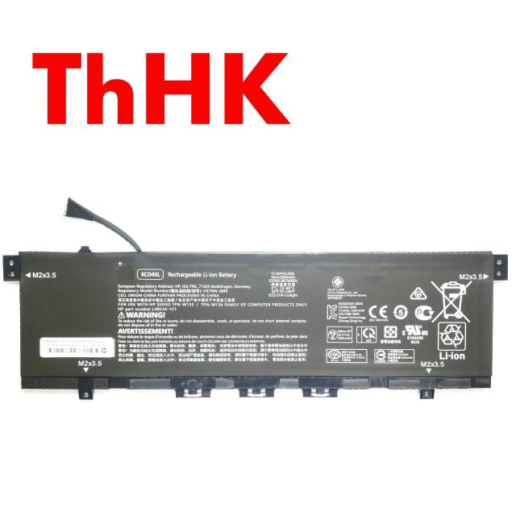

# 动力电池等检测检测系统源码分享
 # [一条龙教学YOLOV8标注好的数据集一键训练_70+全套改进创新点发刊_Web前端展示]

### 1.研究背景与意义

项目参考[AAAI Association for the Advancement of Artificial Intelligence](https://gitee.com/qunshansj/projects)

项目来源[AACV Association for the Advancement of Computer Vision](https://gitee.com/qunmasj/projects)

研究背景与意义

随着全球对可再生能源和电动交通工具的日益关注，动力电池的应用范围不断扩大，涵盖了从电动汽车到便携式电子设备等多个领域。动力电池的种类繁多，包括汽车电池、自行车电池、干电池、笔记本电脑电池和智能手机电池等。随着这些电池的广泛使用，如何高效、准确地检测和分类不同类型的电池，成为了一个亟待解决的问题。传统的电池检测方法往往依赖人工操作，不仅效率低下，而且容易受到人为因素的影响，导致检测结果的不准确。因此，基于计算机视觉的自动化检测系统应运而生，成为提升电池检测效率和准确性的有效手段。

在这一背景下，YOLO（You Only Look Once）系列目标检测算法因其高效性和实时性，逐渐成为研究的热点。YOLOv8作为该系列的最新版本，进一步提升了检测精度和速度，适用于多种复杂场景的目标检测任务。然而，尽管YOLOv8在目标检测领域表现出色，但在特定应用场景下，如动力电池的检测，仍然存在一些挑战。例如，电池的外观形态多样、环境光照变化、背景复杂等因素，都可能影响检测的准确性。因此，针对动力电池检测任务对YOLOv8进行改进，显得尤为重要。

本研究旨在基于改进的YOLOv8算法，构建一个高效的动力电池检测系统。我们将使用8591张标注图像的数据集，这些图像涵盖了五类电池：汽车电池、自行车电池、干电池、笔记本电脑电池和智能手机电池。通过对这些图像进行深入分析和处理，我们希望能够提高模型对不同类型电池的识别能力和分类准确性。此外，改进后的YOLOv8模型将能够在多种实际应用场景中实现实时检测，为电池的回收、管理和安全使用提供技术支持。

本研究的意义不仅在于推动电池检测技术的发展，更在于为可持续发展和环境保护贡献力量。随着电池使用量的增加，电池的回收和再利用问题日益突出。高效的电池检测系统能够帮助企业和机构更好地管理电池资源，降低环境污染风险，促进循环经济的发展。同时，研究成果也将为相关领域的研究者提供参考，推动智能检测技术在其他领域的应用，如电子废弃物处理、产品质量检测等。

综上所述，基于改进YOLOv8的动力电池检测系统的研究，不仅具有重要的学术价值，也具备广泛的应用前景。通过提升电池检测的效率和准确性，我们期待能够为推动电池行业的健康发展、实现资源的可持续利用做出积极贡献。

### 2.图片演示







##### 注意：由于此博客编辑较早，上面“2.图片演示”和“3.视频演示”展示的系统图片或者视频可能为老版本，新版本在老版本的基础上升级如下：（实际效果以升级的新版本为准）

  （1）适配了YOLOV8的“目标检测”模型和“实例分割”模型，通过加载相应的权重（.pt）文件即可自适应加载模型。

  （2）支持“图片识别”、“视频识别”、“摄像头实时识别”三种识别模式。

  （3）支持“图片识别”、“视频识别”、“摄像头实时识别”三种识别结果保存导出，解决手动导出（容易卡顿出现爆内存）存在的问题，识别完自动保存结果并导出到tempDir中。

  （4）支持Web前端系统中的标题、背景图等自定义修改，后面提供修改教程。

  另外本项目提供训练的数据集和训练教程,暂不提供权重文件（best.pt）,需要您按照教程进行训练后实现图片演示和Web前端界面演示的效果。

### 3.视频演示

[3.1 视频演示](https://www.bilibili.com/video/BV1o74BeFE6S/)

### 4.数据集信息展示

##### 4.1 本项目数据集详细数据（类别数＆类别名）

nc: 5
names: ['Automotive Battery', 'Bike Battery', 'Dry Cell', 'Laptop Battery', 'Smartphone Battery']


##### 4.2 本项目数据集信息介绍

数据集信息展示

在现代科技迅速发展的背景下，电池作为各种电子设备和交通工具的核心组成部分，其检测与识别的准确性显得尤为重要。为此，我们构建了一个名为“Battery Detection”的数据集，旨在为改进YOLOv8的动力电池检测系统提供高质量的训练数据。该数据集包含五个主要类别，分别是：汽车电池、摩托车电池、干电池、笔记本电脑电池和智能手机电池。这些类别的选择不仅涵盖了日常生活中常见的电池类型，还考虑到了不同应用场景下的电池特性与需求。

“Battery Detection”数据集的设计理念是为深度学习模型提供丰富的样本，以提高其在实际应用中的检测精度和鲁棒性。每个类别的样本均经过精心挑选和标注，确保数据的多样性和代表性。例如，汽车电池样本不仅包括不同品牌和型号的电池，还涵盖了不同的放置角度和光照条件，以模拟真实环境中的各种情况。摩托车电池的样本同样考虑到了不同车型的电池配置，确保模型能够适应多种摩托车类型的电池检测需求。

在干电池类别中，我们收录了多种常见的干电池型号，包括AA、AAA、9V等，样本的多样性使得模型能够有效识别不同规格的干电池。而在笔记本电脑电池和智能手机电池的样本中，我们则注重于不同品牌和容量的电池，力求涵盖市场上主流的电池类型。通过这种方式，我们希望“Battery Detection”数据集能够为研究人员和开发者提供一个强大的基础，助力他们在电池检测领域的创新与突破。

此外，数据集中的每个样本都附带了详细的标注信息，包括类别标签、边界框坐标等。这些信息不仅有助于训练深度学习模型，也为后续的模型评估和性能分析提供了必要的数据支持。通过使用这些标注信息，研究人员可以轻松地评估模型在不同类别上的检测精度，进而进行针对性的优化和改进。

在数据集的构建过程中，我们还特别关注了数据的平衡性，确保每个类别的样本数量相对均衡，以避免模型在训练过程中出现偏向某一类别的现象。这种平衡性对于提升模型的泛化能力至关重要，使其能够在面对未见过的样本时，依然保持较高的识别准确率。

总之，“Battery Detection”数据集的创建旨在为改进YOLOv8的动力电池检测系统提供坚实的数据基础。通过丰富的样本、多样的类别和详尽的标注信息，我们希望能够推动电池检测技术的发展，为智能交通、电子产品管理等领域的应用提供更为精准的解决方案。随着数据集的不断完善和扩展，我们期待在未来的研究中，能够实现更高效、更智能的电池检测系统，为可持续发展贡献一份力量。









### 5.全套项目环境部署视频教程（零基础手把手教学）

[5.1 环境部署教程链接（零基础手把手教学）](https://www.ixigua.com/7404473917358506534?logTag=c807d0cbc21c0ef59de5)


[5.2 安装Python虚拟环境创建和依赖库安装视频教程链接（零基础手把手教学）](https://www.ixigua.com/7404474678003106304?logTag=1f1041108cd1f708b01a)

### 6.手把手YOLOV8训练视频教程（零基础小白有手就能学会）

[6.1 手把手YOLOV8训练视频教程（零基础小白有手就能学会）](https://www.ixigua.com/7404477157818401292?logTag=d31a2dfd1983c9668658)

### 7.70+种全套YOLOV8创新点代码加载调参视频教程（一键加载写好的改进模型的配置文件）

[7.1 70+种全套YOLOV8创新点代码加载调参视频教程（一键加载写好的改进模型的配置文件）](https://www.ixigua.com/7404478314661806627?logTag=29066f8288e3f4eea3a4)

### 8.70+种全套YOLOV8创新点原理讲解（非科班也可以轻松写刊发刊，V10版本正在科研待更新）

由于篇幅限制，每个创新点的具体原理讲解就不一一展开，具体见下列网址中的创新点对应子项目的技术原理博客网址【Blog】：


[8.1 70+种全套YOLOV8创新点原理讲解链接](https://gitee.com/qunmasj/good)

### 9.系统功能展示（检测对象为举例，实际内容以本项目数据集为准）

图9.1.系统支持检测结果表格显示

  图9.2.系统支持置信度和IOU阈值手动调节

  图9.3.系统支持自定义加载权重文件best.pt(需要你通过步骤5中训练获得)

  图9.4.系统支持摄像头实时识别

  图9.5.系统支持图片识别

  图9.6.系统支持视频识别

  图9.7.系统支持识别结果文件自动保存

  图9.8.系统支持Excel导出检测结果数据


### 10.原始YOLOV8算法原理

原始YOLOv8算法原理

YOLOv8作为目标检测领域的最新版本，代表了YOLO系列模型的又一次重大进化。它在设计上融合了多种先进的技术和理念，以实现更高的检测精度和更快的推理速度。YOLOv8的架构主要由输入层、主干网络、颈部网络和头部网络四个关键部分构成，每个部分都承担着特定的功能，协同工作以提升整体性能。

首先，输入层负责接收原始图像并进行预处理。为了适应网络的输入要求，图像会被缩放到指定的尺寸。这一过程不仅保证了输入数据的一致性，还为后续的特征提取奠定了基础。接下来，主干网络作为特征提取的核心，通过一系列卷积操作对输入图像进行下采样。每个卷积层都配备了批归一化和SiLUR激活函数，这样的设计不仅加速了训练过程，还提高了模型的收敛速度和稳定性。

在主干网络中，C2f块的引入是YOLOv8的一大亮点。该模块借鉴了YOLOv7中的E-ELAN结构，通过跨层分支连接的方式，增强了模型的梯度流动性。这种设计使得网络在训练过程中能够更有效地传播信息，从而改善检测结果。主干网络的末尾，SPPFl块通过三个最大池化层的组合，进一步处理多尺度特征。这一过程不仅提升了网络的特征抽象能力，还增强了模型对不同尺寸目标的检测能力。

在完成特征提取后，颈部网络的作用便显得尤为重要。它利用FPNS（Feature Pyramid Network）和PAN（Path Aggregation Network）结构，融合来自不同尺度的特征图信息。这种特征融合策略使得YOLOv8能够在多尺度环境下保持高效的检测性能，确保小目标和大目标都能被准确识别。颈部网络将融合后的特征图传递给头部网络，后者负责最终的目标检测任务。

YOLOv8的头部网络采用了解耦的检测头设计，通过两个并行的卷积分支分别计算回归和类别的损失。这种解耦设计的优势在于，它能够独立优化目标的定位和分类任务，从而提高了模型的整体性能和灵活性。具体而言，一个分支专注于预测目标的边界框位置，而另一个分支则负责判断目标的类别。这种结构的引入，使得YOLOv8在处理复杂场景时，能够更有效地分离和处理不同类型的信息。

值得一提的是，YOLOv8在模型设置上也提供了更大的灵活性。通过调整depth_factor、width_factor和ratio等参数，用户可以根据具体应用需求，灵活地设置模型的深度和宽度。这种可调性使得YOLOv8能够适应多种硬件环境和应用场景，从而扩展了其在实际应用中的适用性。

总的来说，YOLOv8通过对主干网络、颈部网络和头部网络的精心设计与优化，成功地提升了目标检测的速度和精度。其创新的特征提取和融合策略，使得模型在处理复杂场景时表现出色。此外，解耦的检测头设计为模型的训练和优化提供了更多的灵活性，进一步增强了YOLOv8在目标检测领域的竞争力。随着YOLOv8的广泛应用，它不仅推动了目标检测技术的发展，也为相关领域的研究提供了新的思路和方向。


### 11.项目核心源码讲解（再也不用担心看不懂代码逻辑）

#### 11.1 ui.py

以下是对代码的核心部分进行保留和详细注释的版本：

```python
import sys
import subprocess

def run_script(script_path):
    """
    使用当前 Python 环境运行指定的脚本。

    Args:
        script_path (str): 要运行的脚本路径

    Returns:
        None
    """
    # 获取当前 Python 解释器的路径
    python_path = sys.executable

    # 构建运行命令，使用 streamlit 运行指定的脚本
    command = f'"{python_path}" -m streamlit run "{script_path}"'

    # 执行命令并等待其完成
    result = subprocess.run(command, shell=True)
    
    # 检查命令执行的返回码，如果不为0则表示出错
    if result.returncode != 0:
        print("脚本运行出错。")

# 实例化并运行应用
if __name__ == "__main__":
    # 指定要运行的脚本路径
    script_path = "web.py"  # 这里可以直接指定脚本名

    # 调用函数运行脚本
    run_script(script_path)
```

### 代码核心部分分析：

1. **导入模块**：
   - `sys`：用于获取当前 Python 解释器的路径。
   - `subprocess`：用于执行外部命令。

2. **`run_script` 函数**：
   - 该函数接收一个脚本路径作为参数，并使用当前 Python 环境来运行这个脚本。
   - 使用 `sys.executable` 获取当前 Python 解释器的路径，以确保使用的是正确的 Python 环境。
   - 构建一个命令字符串，该命令将使用 `streamlit` 模块来运行指定的脚本。
   - 使用 `subprocess.run` 执行构建的命令，并通过 `shell=True` 允许在 shell 中执行。
   - 检查命令的返回码，如果返回码不为0，表示脚本运行出错，打印错误信息。

3. **主程序入口**：
   - 使用 `if __name__ == "__main__":` 确保只有在直接运行该脚本时才会执行下面的代码。
   - 指定要运行的脚本路径（这里是 `web.py`）。
   - 调用 `run_script` 函数来执行指定的脚本。 

这样，代码的核心逻辑和功能得以保留，并且添加了详细的中文注释以便理解。

这个程序文件名为 `ui.py`，它的主要功能是通过当前的 Python 环境来运行一个指定的脚本，具体是一个名为 `web.py` 的文件。代码中首先导入了必要的模块，包括 `sys`、`os` 和 `subprocess`，这些模块提供了与系统交互的功能。`QtFusion.path` 模块中的 `abs_path` 函数用于获取文件的绝对路径。

在 `run_script` 函数中，首先获取当前 Python 解释器的路径，这通过 `sys.executable` 实现。接着，构建一个命令字符串，这个命令用于调用 `streamlit` 运行指定的脚本。`streamlit` 是一个用于构建数据应用的框架，命令的格式是将 Python 解释器与 `-m streamlit run` 结合，后面跟上要运行的脚本路径。

然后，使用 `subprocess.run` 方法执行这个命令。这个方法会在一个新的进程中运行命令，并等待其完成。若命令执行的返回码不为零，表示脚本运行出错，程序会输出一条错误信息。

在文件的最后部分，使用 `if __name__ == "__main__":` 语句来确保当该文件作为主程序运行时，才会执行后面的代码。这里指定了要运行的脚本路径为 `web.py`，并调用 `run_script` 函数来执行这个脚本。

总体来看，这个程序的设计目的是为了方便地通过命令行启动一个基于 `streamlit` 的应用，简化了用户的操作流程。

#### 11.2 70+种YOLOv8算法改进源码大全和调试加载训练教程（非必要）\ultralytics\models\sam\modules\__init__.py

以下是代码的核心部分，并附上详细的中文注释：

```python
# Ultralytics YOLO 🚀, AGPL-3.0 license

# 这是Ultralytics YOLO模型的开源代码，遵循AGPL-3.0许可证
# YOLO（You Only Look Once）是一种实时目标检测系统
```

### 详细注释：
1. **Ultralytics YOLO**：这是一个基于YOLO架构的目标检测模型，Ultralytics是该模型的开发者。
2. **AGPL-3.0 license**：该代码遵循AGPL-3.0许可证，意味着用户可以自由使用、修改和分发代码，但必须在相同许可证下发布修改后的代码。

这段代码的核心在于表明其来源和许可证信息，具体的实现细节和功能则需要查看更详细的代码部分。

这个文件是Ultralytics YOLO（You Only Look Once）项目的一部分，主要涉及YOLOv8算法的实现和相关模块的初始化。文件开头的注释表明该项目遵循AGPL-3.0许可证，这意味着用户可以自由使用、修改和分发代码，但需要遵循相应的许可证条款。

在这个文件中，通常会包含一些必要的模块导入和初始化代码，以便在其他部分调用YOLOv8算法的功能。具体来说，这可能包括模型的定义、训练和推理的相关功能，以及其他辅助工具和方法。

由于文件内容非常简短，仅包含一个许可证声明，因此我们无法看到具体的实现细节。但可以推测，这个文件在整个YOLOv8项目中起着重要的作用，确保其他模块能够正确地访问和使用YOLOv8的功能。

总的来说，这个文件是YOLOv8算法改进源码的一部分，旨在为用户提供一个强大的目标检测工具，帮助他们在计算机视觉任务中实现高效的物体识别和定位。

#### 11.3 70+种YOLOv8算法改进源码大全和调试加载训练教程（非必要）\ultralytics\data\build.py

以下是经过简化和注释的核心代码部分：

```python
import os
import random
import numpy as np
import torch
from torch.utils.data import dataloader
from .dataset import YOLODataset
from .utils import PIN_MEMORY

class InfiniteDataLoader(dataloader.DataLoader):
    """
    无限循环的数据加载器，继承自PyTorch的DataLoader。
    """

    def __init__(self, *args, **kwargs):
        """初始化InfiniteDataLoader，重用工作线程。"""
        super().__init__(*args, **kwargs)
        # 使用自定义的重复采样器
        object.__setattr__(self, 'batch_sampler', _RepeatSampler(self.batch_sampler))
        self.iterator = super().__iter__()

    def __len__(self):
        """返回批次采样器的长度。"""
        return len(self.batch_sampler.sampler)

    def __iter__(self):
        """创建一个无限重复的迭代器。"""
        for _ in range(len(self)):
            yield next(self.iterator)

    def reset(self):
        """重置迭代器，便于在训练过程中修改数据集设置。"""
        self.iterator = self._get_iterator()


class _RepeatSampler:
    """
    无限重复的采样器。
    """

    def __init__(self, sampler):
        """初始化重复采样器。"""
        self.sampler = sampler

    def __iter__(self):
        """无限迭代采样器的内容。"""
        while True:
            yield from iter(self.sampler)


def seed_worker(worker_id):
    """设置数据加载器工作线程的随机种子。"""
    worker_seed = torch.initial_seed() % 2 ** 32
    np.random.seed(worker_seed)
    random.seed(worker_seed)


def build_yolo_dataset(cfg, img_path, batch, data, mode='train', rect=False, stride=32):
    """构建YOLO数据集。"""
    return YOLODataset(
        img_path=img_path,
        imgsz=cfg.imgsz,  # 图像大小
        batch_size=batch,  # 批次大小
        augment=mode == 'train',  # 是否进行数据增强
        hyp=cfg,  # 超参数配置
        rect=cfg.rect or rect,  # 是否使用矩形批次
        cache=cfg.cache or None,  # 是否缓存数据
        single_cls=cfg.single_cls or False,  # 是否单类
        stride=int(stride),  # 步幅
        pad=0.0 if mode == 'train' else 0.5,  # 填充
        classes=cfg.classes,  # 类别
        data=data,  # 数据配置
        fraction=cfg.fraction if mode == 'train' else 1.0  # 训练时的数据比例
    )


def build_dataloader(dataset, batch, workers, shuffle=True, rank=-1):
    """返回用于训练或验证集的InfiniteDataLoader或DataLoader。"""
    batch = min(batch, len(dataset))  # 确保批次大小不超过数据集大小
    nd = torch.cuda.device_count()  # CUDA设备数量
    nw = min([os.cpu_count() // max(nd, 1), batch if batch > 1 else 0, workers])  # 工作线程数量
    sampler = None if rank == -1 else distributed.DistributedSampler(dataset, shuffle=shuffle)  # 分布式采样器
    generator = torch.Generator()
    generator.manual_seed(6148914691236517205)  # 设置随机种子
    return InfiniteDataLoader(dataset=dataset,
                              batch_size=batch,
                              shuffle=shuffle and sampler is None,
                              num_workers=nw,
                              sampler=sampler,
                              pin_memory=PIN_MEMORY,
                              worker_init_fn=seed_worker)  # 初始化工作线程时设置随机种子
```

### 代码说明：
1. **InfiniteDataLoader**：这是一个自定义的数据加载器，允许无限循环地从数据集中提取数据。它重写了`__iter__`方法，使得可以在每次迭代时重新开始。
  
2. **_RepeatSampler**：这是一个辅助类，用于实现无限重复的采样器，允许在数据集上进行无限次迭代。

3. **seed_worker**：这个函数用于设置每个工作线程的随机种子，以确保数据加载的随机性可控。

4. **build_yolo_dataset**：这个函数用于构建YOLO数据集，接受配置参数并返回一个YOLODataset实例。

5. **build_dataloader**：这个函数用于创建数据加载器，支持分布式训练和多线程数据加载，返回一个InfiniteDataLoader实例。

这个程序文件是一个用于构建YOLO（You Only Look Once）模型数据加载器的模块，主要涉及数据集的创建、数据加载和处理等功能。程序中定义了多个类和函数，旨在为YOLO模型的训练和推理提供高效的数据输入。

首先，程序导入了一些必要的库，包括操作系统相关的库、随机数生成库、路径处理库、NumPy、PyTorch、PIL图像处理库等。接着，程序从`ultralytics`库中导入了一些用于数据加载的工具和常量。

`InfiniteDataLoader`类是一个自定义的数据加载器，继承自PyTorch的`DataLoader`。它的特点是可以无限循环使用工作线程，这样在训练过程中可以不断地从数据集中获取数据。该类重写了`__len__`和`__iter__`方法，以实现无限迭代的功能。此外，它还提供了一个`reset`方法，用于在训练过程中重置迭代器，以便可以修改数据集的设置。

`_RepeatSampler`类是一个辅助类，用于实现对给定采样器的无限重复。它的`__iter__`方法会不断迭代采样器，确保数据加载的连续性。

`seed_worker`函数用于设置数据加载器工作线程的随机种子，以确保在多线程环境下的随机性一致性。这对于数据增强等操作尤为重要。

`build_yolo_dataset`函数用于构建YOLO数据集。它接收多个参数，包括配置、图像路径、批次大小等，并返回一个`YOLODataset`对象。该函数还根据训练模式决定是否进行数据增强，并处理其他与数据集相关的设置。

`build_dataloader`函数则用于返回一个`InfiniteDataLoader`或标准的`DataLoader`，具体取决于输入的数据集、批次大小和工作线程数等参数。它还会根据CUDA设备的数量和可用的CPU核心数来计算合适的工作线程数量，并支持分布式训练。

`check_source`函数用于检查输入源的类型，并返回相应的标志值。这些标志值用于确定输入源是视频流、图像文件、Tensor等类型，以便后续处理。

最后，`load_inference_source`函数用于加载推理源，并应用必要的转换。它会调用`check_source`函数来识别输入源的类型，并根据类型选择合适的数据加载方式，如加载图像、视频流、Tensor等。最终返回一个数据集对象，以供后续的推理使用。

总体而言，这个程序文件为YOLO模型的训练和推理提供了灵活而高效的数据处理能力，能够适应多种输入源和数据格式。

#### 11.4 train.py

以下是代码中最核心的部分，并附上详细的中文注释：

```python
class DetectionTrainer(BaseTrainer):
    """
    DetectionTrainer类扩展了BaseTrainer类，用于基于检测模型的训练。
    """

    def build_dataset(self, img_path, mode="train", batch=None):
        """
        构建YOLO数据集。

        参数:
            img_path (str): 包含图像的文件夹路径。
            mode (str): 模式，可以是'train'或'val'，用户可以为每种模式自定义不同的增强。
            batch (int, optional): 批次大小，仅用于'rect'模式。默认为None。
        """
        gs = max(int(de_parallel(self.model).stride.max() if self.model else 0), 32)
        return build_yolo_dataset(self.args, img_path, batch, self.data, mode=mode, rect=mode == "val", stride=gs)

    def get_dataloader(self, dataset_path, batch_size=16, rank=0, mode="train"):
        """构造并返回数据加载器。"""
        assert mode in ["train", "val"]  # 确保模式是'train'或'val'
        with torch_distributed_zero_first(rank):  # 仅在DDP中初始化数据集*.cache一次
            dataset = self.build_dataset(dataset_path, mode, batch_size)  # 构建数据集
        shuffle = mode == "train"  # 训练模式下打乱数据
        if getattr(dataset, "rect", False) and shuffle:
            LOGGER.warning("WARNING ⚠️ 'rect=True'与DataLoader的shuffle不兼容，设置shuffle=False")
            shuffle = False
        workers = self.args.workers if mode == "train" else self.args.workers * 2  # 设置工作线程数
        return build_dataloader(dataset, batch_size, workers, shuffle, rank)  # 返回数据加载器

    def preprocess_batch(self, batch):
        """对一批图像进行预处理，包括缩放和转换为浮点数。"""
        batch["img"] = batch["img"].to(self.device, non_blocking=True).float() / 255  # 将图像转换为浮点数并归一化
        if self.args.multi_scale:  # 如果启用多尺度
            imgs = batch["img"]
            sz = (
                random.randrange(self.args.imgsz * 0.5, self.args.imgsz * 1.5 + self.stride)
                // self.stride
                * self.stride
            )  # 随机选择图像大小
            sf = sz / max(imgs.shape[2:])  # 计算缩放因子
            if sf != 1:  # 如果缩放因子不为1
                ns = [
                    math.ceil(x * sf / self.stride) * self.stride for x in imgs.shape[2:]
                ]  # 计算新的形状
                imgs = nn.functional.interpolate(imgs, size=ns, mode="bilinear", align_corners=False)  # 进行插值缩放
            batch["img"] = imgs  # 更新批次中的图像
        return batch

    def set_model_attributes(self):
        """设置模型的属性，包括类别数量和名称。"""
        self.model.nc = self.data["nc"]  # 将类别数量附加到模型
        self.model.names = self.data["names"]  # 将类别名称附加到模型
        self.model.args = self.args  # 将超参数附加到模型

    def get_model(self, cfg=None, weights=None, verbose=True):
        """返回YOLO检测模型。"""
        model = DetectionModel(cfg, nc=self.data["nc"], verbose=verbose and RANK == -1)  # 创建检测模型
        if weights:
            model.load(weights)  # 加载权重
        return model

    def get_validator(self):
        """返回YOLO模型验证器。"""
        self.loss_names = "box_loss", "cls_loss", "dfl_loss"  # 定义损失名称
        return yolo.detect.DetectionValidator(
            self.test_loader, save_dir=self.save_dir, args=copy(self.args), _callbacks=self.callbacks
        )

    def plot_training_samples(self, batch, ni):
        """绘制带有注释的训练样本。"""
        plot_images(
            images=batch["img"],
            batch_idx=batch["batch_idx"],
            cls=batch["cls"].squeeze(-1),
            bboxes=batch["bboxes"],
            paths=batch["im_file"],
            fname=self.save_dir / f"train_batch{ni}.jpg",
            on_plot=self.on_plot,
        )
```

### 代码核心部分说明：
1. **DetectionTrainer类**：继承自BaseTrainer，专门用于YOLO模型的训练。
2. **build_dataset方法**：根据给定的图像路径和模式构建YOLO数据集，支持训练和验证模式。
3. **get_dataloader方法**：构建并返回数据加载器，支持多线程和数据打乱。
4. **preprocess_batch方法**：对输入的图像批次进行预处理，包括归一化和可选的多尺度调整。
5. **set_model_attributes方法**：设置模型的类别数量和名称等属性。
6. **get_model方法**：返回一个YOLO检测模型，并可选择加载预训练权重。
7. **get_validator方法**：返回用于模型验证的检测验证器。
8. **plot_training_samples方法**：绘制训练样本及其注释，便于可视化训练过程。

这个程序文件 `train.py` 是一个用于训练目标检测模型的代码，主要基于 YOLO（You Only Look Once）算法。它继承自 `BaseTrainer` 类，专注于处理目标检测任务。文件中包含多个方法，用于构建数据集、获取数据加载器、预处理图像、设置模型属性、获取模型、验证模型、记录损失、绘制训练进度和结果等。

首先，`DetectionTrainer` 类中定义了 `build_dataset` 方法，用于构建 YOLO 数据集。该方法接收图像路径、模式（训练或验证）和批次大小作为参数，并返回构建好的数据集。它使用了 `build_yolo_dataset` 函数，允许用户为不同模式自定义数据增强。

接下来，`get_dataloader` 方法用于构建和返回数据加载器。它会根据模式（训练或验证）来设置数据加载的参数，并确保在分布式训练中只初始化一次数据集。方法中还处理了数据加载时的随机打乱和工作线程数量的设置。

在 `preprocess_batch` 方法中，程序对图像批次进行预处理，包括将图像缩放到合适的大小并转换为浮点数格式。它还支持多尺度训练，通过随机选择图像大小来增强模型的鲁棒性。

`set_model_attributes` 方法用于设置模型的属性，包括类别数量和类别名称等，以确保模型能够正确处理训练数据。

`get_model` 方法返回一个 YOLO 检测模型，并可选择加载预训练权重。`get_validator` 方法则返回一个用于验证模型性能的验证器。

在损失记录方面，`label_loss_items` 方法将训练损失项转换为字典格式，方便后续处理和记录。`progress_string` 方法返回一个格式化的字符串，显示训练进度，包括当前的 epoch、GPU 内存使用情况、损失值、实例数量和图像大小等信息。

此外，`plot_training_samples` 方法用于绘制训练样本及其标注，帮助可视化训练过程中的数据。`plot_metrics` 和 `plot_training_labels` 方法则用于绘制训练过程中的各种指标和标签，生成相应的图像文件以便于分析和评估模型性能。

整体而言，这个文件实现了一个完整的目标检测模型训练流程，涵盖了数据准备、模型构建、训练过程监控和结果可视化等多个方面，适合用于 YOLO 模型的训练与评估。

#### 11.5 code\ultralytics\models\rtdetr\train.py

以下是经过简化和注释的核心代码部分：

```python
# 导入必要的库
from copy import copy
import torch
from ultralytics.models.yolo.detect import DetectionTrainer
from ultralytics.nn.tasks import RTDETRDetectionModel
from ultralytics.utils import RANK, colorstr
from .val import RTDETRDataset, RTDETRValidator

class RTDETRTrainer(DetectionTrainer):
    """
    RT-DETR模型的训练类，专为实时目标检测而设计，继承自YOLO的DetectionTrainer类。
    该模型利用视觉变换器（Vision Transformers）并具备IoU感知查询选择和可调推理速度等功能。
    """

    def get_model(self, cfg=None, weights=None, verbose=True):
        """
        初始化并返回一个用于目标检测的RT-DETR模型。

        参数:
            cfg (dict, optional): 模型配置，默认为None。
            weights (str, optional): 预训练模型权重的路径，默认为None。
            verbose (bool): 如果为True，则启用详细日志，默认为True。

        返回:
            (RTDETRDetectionModel): 初始化后的模型。
        """
        # 创建RT-DETR检测模型实例
        model = RTDETRDetectionModel(cfg, nc=self.data["nc"], verbose=verbose and RANK == -1)
        # 如果提供了权重，则加载权重
        if weights:
            model.load(weights)
        return model

    def build_dataset(self, img_path, mode="val", batch=None):
        """
        构建并返回用于训练或验证的RT-DETR数据集。

        参数:
            img_path (str): 包含图像的文件夹路径。
            mode (str): 数据集模式，可以是'train'或'val'。
            batch (int, optional): 矩形训练的批次大小，默认为None。

        返回:
            (RTDETRDataset): 针对特定模式的数据集对象。
        """
        # 创建RT-DETR数据集实例
        return RTDETRDataset(
            img_path=img_path,
            imgsz=self.args.imgsz,
            batch_size=batch,
            augment=mode == "train",  # 训练模式下进行数据增强
            hyp=self.args,
            rect=False,
            cache=self.args.cache or None,
            prefix=colorstr(f"{mode}: "),  # 为模式添加前缀
            data=self.data,
        )

    def get_validator(self):
        """
        返回适合RT-DETR模型验证的检测验证器。

        返回:
            (RTDETRValidator): 用于模型验证的验证器对象。
        """
        self.loss_names = "giou_loss", "cls_loss", "l1_loss"  # 定义损失名称
        return RTDETRValidator(self.test_loader, save_dir=self.save_dir, args=copy(self.args))

    def preprocess_batch(self, batch):
        """
        预处理一批图像，缩放并转换图像为浮点格式。

        参数:
            batch (dict): 包含一批图像、边界框和标签的字典。

        返回:
            (dict): 预处理后的批次。
        """
        # 调用父类的预处理方法
        batch = super().preprocess_batch(batch)
        bs = len(batch["img"])  # 批次大小
        batch_idx = batch["batch_idx"]  # 批次索引
        gt_bbox, gt_class = [], []  # 初始化真实边界框和类别列表
        
        # 遍历每个图像，提取对应的边界框和类别
        for i in range(bs):
            gt_bbox.append(batch["bboxes"][batch_idx == i].to(batch_idx.device))  # 获取当前图像的边界框
            gt_class.append(batch["cls"][batch_idx == i].to(device=batch_idx.device, dtype=torch.long))  # 获取当前图像的类别
        return batch  # 返回预处理后的批次
```

### 代码说明：
1. **导入部分**：引入了必要的库和模块，包括模型训练类、数据集类和验证器类。
2. **RTDETRTrainer类**：这是一个用于训练RT-DETR模型的类，继承自YOLO的DetectionTrainer类，包含模型初始化、数据集构建、验证器获取和批次预处理等功能。
3. **get_model方法**：用于初始化RT-DETR模型，支持加载预训练权重。
4. **build_dataset方法**：根据输入的图像路径和模式（训练或验证）构建数据集。
5. **get_validator方法**：返回一个验证器，用于模型的验证过程。
6. **preprocess_batch方法**：对输入的图像批次进行预处理，包括缩放和类型转换，确保数据格式符合模型要求。

这个程序文件是一个用于训练RT-DETR模型的Python脚本，RT-DETR是百度开发的一种实时目标检测模型。该脚本继承自YOLO的DetectionTrainer类，并对RT-DETR模型的特性和架构进行了适配。

首先，文件导入了一些必要的库和模块，包括PyTorch和Ultralytics库中的相关组件。RTDETRTrainer类是该文件的核心，负责模型的训练过程。类中包含了一些重要的方法和说明。

在类的文档字符串中，简要介绍了RT-DETR模型的特点，包括其基于视觉变换器的架构、IoU感知的查询选择能力以及可调的推理速度。同时提到了一些注意事项，例如F.grid_sample在RT-DETR中不支持`deterministic=True`参数，以及AMP训练可能导致NaN输出和在二分图匹配过程中出现错误。

get_model方法用于初始化并返回一个RT-DETR模型，接受模型配置、预训练权重路径和详细日志参数。该方法会创建一个RTDETRDetectionModel实例，并在提供权重的情况下加载这些权重。

build_dataset方法用于构建和返回一个RT-DETR数据集，接受图像路径、模式（训练或验证）和批量大小作为参数。它会创建一个RTDETRDataset实例，并根据传入的参数配置数据集。

get_validator方法返回一个适用于RT-DETR模型验证的检测验证器RTDETRValidator，并设置损失名称，包括giou_loss、cls_loss和l1_loss。

preprocess_batch方法用于对一批图像进行预处理，包括缩放和转换为浮点格式。它从父类中调用了预处理方法，并根据批次索引提取每个图像的真实边界框和类别标签，最终返回预处理后的批次数据。

总的来说，这个文件实现了RT-DETR模型的训练框架，提供了模型初始化、数据集构建、验证器获取和批次预处理等功能，旨在支持高效的实时目标检测任务。

#### 11.6 code\ultralytics\engine\results.py

以下是经过简化并添加详细中文注释的核心代码部分：

```python
import numpy as np
import torch

class BaseTensor:
    """基础张量类，提供对数据的基本操作和设备管理。"""

    def __init__(self, data, orig_shape) -> None:
        """
        初始化 BaseTensor 类。

        参数:
            data (torch.Tensor | np.ndarray): 预测结果，例如边界框、掩码和关键点。
            orig_shape (tuple): 原始图像的形状。
        """
        assert isinstance(data, (torch.Tensor, np.ndarray))
        self.data = data  # 存储数据
        self.orig_shape = orig_shape  # 存储原始形状

    @property
    def shape(self):
        """返回数据张量的形状。"""
        return self.data.shape

    def cpu(self):
        """返回一个在 CPU 内存上的张量副本。"""
        return self if isinstance(self.data, np.ndarray) else self.__class__(self.data.cpu(), self.orig_shape)

    def numpy(self):
        """返回一个作为 numpy 数组的张量副本。"""
        return self if isinstance(self.data, np.ndarray) else self.__class__(self.data.numpy(), self.orig_shape)

    def cuda(self):
        """返回一个在 GPU 内存上的张量副本。"""
        return self.__class__(torch.as_tensor(self.data).cuda(), self.orig_shape)

    def __len__(self):
        """返回数据张量的长度。"""
        return len(self.data)

    def __getitem__(self, idx):
        """返回指定索引的 BaseTensor。"""
        return self.__class__(self.data[idx], self.orig_shape)


class Results:
    """
    存储和操作推理结果的类。

    参数:
        orig_img (numpy.ndarray): 原始图像。
        path (str): 图像文件的路径。
        names (dict): 类别名称的字典。
        boxes (torch.tensor, optional): 每个检测的边界框坐标的 2D 张量。
        masks (torch.tensor, optional): 检测掩码的 3D 张量。
        probs (torch.tensor, optional): 每个类别的概率的 1D 张量。
        keypoints (List[List[float]], optional): 每个对象的检测关键点列表。
    """

    def __init__(self, orig_img, path, names, boxes=None, masks=None, probs=None, keypoints=None) -> None:
        """初始化 Results 类。"""
        self.orig_img = orig_img  # 存储原始图像
        self.orig_shape = orig_img.shape[:2]  # 存储原始图像的形状
        self.boxes = Boxes(boxes, self.orig_shape) if boxes is not None else None  # 存储边界框
        self.masks = Masks(masks, self.orig_shape) if masks is not None else None  # 存储掩码
        self.probs = Probs(probs) if probs is not None else None  # 存储概率
        self.keypoints = Keypoints(keypoints, self.orig_shape) if keypoints is not None else None  # 存储关键点
        self.names = names  # 存储类别名称
        self.path = path  # 存储图像路径

    def __getitem__(self, idx):
        """返回指定索引的 Results 对象。"""
        return self._apply("__getitem__", idx)

    def __len__(self):
        """返回 Results 对象中的检测数量。"""
        for k in ["boxes", "masks", "probs", "keypoints"]:
            v = getattr(self, k)
            if v is not None:
                return len(v)

    def update(self, boxes=None, masks=None, probs=None):
        """更新 Results 对象的 boxes、masks 和 probs 属性。"""
        if boxes is not None:
            self.boxes = Boxes(boxes, self.orig_shape)
        if masks is not None:
            self.masks = Masks(masks, self.orig_shape)
        if probs is not None:
            self.probs = probs

    def _apply(self, fn, *args, **kwargs):
        """对所有非空属性应用指定函数，并返回修改后的新 Results 对象。"""
        r = self.new()
        for k in ["boxes", "masks", "probs", "keypoints"]:
            v = getattr(self, k)
            if v is not None:
                setattr(r, k, getattr(v, fn)(*args, **kwargs))
        return r

    def cpu(self):
        """返回一个在 CPU 内存上的 Results 对象副本。"""
        return self._apply("cpu")

    def numpy(self):
        """返回一个作为 numpy 数组的 Results 对象副本。"""
        return self._apply("numpy")

    def cuda(self):
        """返回一个在 GPU 内存上的 Results 对象副本。"""
        return self._apply("cuda")

    def new(self):
        """返回一个新的 Results 对象，具有相同的图像、路径和名称。"""
        return Results(orig_img=self.orig_img, path=self.path, names=self.names)

class Boxes(BaseTensor):
    """
    存储和操作检测框的类。

    参数:
        boxes (torch.Tensor | numpy.ndarray): 包含检测框的张量或 numpy 数组。
        orig_shape (tuple): 原始图像的大小。
    """

    def __init__(self, boxes, orig_shape) -> None:
        """初始化 Boxes 类。"""
        if boxes.ndim == 1:
            boxes = boxes[None, :]  # 如果是一维数组，转换为二维数组
        n = boxes.shape[-1]
        assert n in (6, 7), f"expected 6 or 7 values but got {n}"  # 确保数据格式正确
        super().__init__(boxes, orig_shape)  # 调用父类构造函数
        self.orig_shape = orig_shape  # 存储原始形状

    @property
    def xyxy(self):
        """返回 xyxy 格式的边界框。"""
        return self.data[:, :4]

    @property
    def conf(self):
        """返回边界框的置信度值。"""
        return self.data[:, -2]

    @property
    def cls(self):
        """返回边界框的类别值。"""
        return self.data[:, -1]

class Masks(BaseTensor):
    """
    存储和操作检测掩码的类。
    """

    def __init__(self, masks, orig_shape) -> None:
        """初始化 Masks 类。"""
        if masks.ndim == 2:
            masks = masks[None, :]  # 如果是一维数组，转换为二维数组
        super().__init__(masks, orig_shape)  # 调用父类构造函数

class Keypoints(BaseTensor):
    """
    存储和操作检测关键点的类。
    """

    def __init__(self, keypoints, orig_shape) -> None:
        """初始化 Keypoints 类。"""
        if keypoints.ndim == 2:
            keypoints = keypoints[None, :]  # 如果是一维数组，转换为二维数组
        super().__init__(keypoints, orig_shape)  # 调用父类构造函数

class Probs(BaseTensor):
    """
    存储和操作分类预测的类。
    """

    def __init__(self, probs, orig_shape=None) -> None:
        """初始化 Probs 类。"""
        super().__init__(probs, orig_shape)  # 调用父类构造函数
```

以上代码保留了核心类和方法，并添加了详细的中文注释，便于理解其功能和用途。

这个程序文件是Ultralytics YOLO（You Only Look Once）目标检测框架的一部分，主要用于处理推理结果，包括检测框、掩码和关键点等。该文件定义了多个类，用于存储和操作这些推理结果。

首先，`BaseTensor`类是一个基础类，提供了一些便捷的方法来处理张量数据，包括在CPU和GPU之间的转换、返回numpy数组等。它接受数据和原始图像的形状作为输入，并提供了获取张量形状、长度和索引的功能。

接下来是`Results`类，它用于存储和操作推理结果。该类包含原始图像、路径、类别名称、检测框、掩码、概率和关键点等属性。它提供了更新结果、获取结果长度、索引和绘图等方法。绘图方法允许在输入图像上绘制检测结果，包括检测框、掩码和关键点等。

`Boxes`、`Masks`、`Keypoints`、`Probs`和`OBB`类分别用于处理检测框、掩码、关键点、分类概率和定向边界框（OBB）。这些类继承自`BaseTensor`，并提供了特定于各自数据类型的属性和方法。例如，`Boxes`类提供了获取框的xyxy格式、置信度和类别等属性，`Masks`类则处理掩码的像素坐标和归一化坐标。

在`Results`类中，还有一些实用的方法，例如`save_txt`用于将检测结果保存到文本文件，`save_crop`用于保存裁剪后的检测结果，`tojson`则将结果转换为JSON格式。这些功能使得用户可以方便地保存和共享检测结果。

总的来说，这个文件为YOLO模型的推理结果提供了一个结构化的处理方式，使得用户能够轻松地获取和操作检测结果，并将其可视化或保存到文件中。

### 12.系统整体结构（节选）

### 整体功能和构架概括

该项目是一个基于YOLO（You Only Look Once）算法的目标检测框架，旨在提供高效的模型训练、推理和结果处理功能。项目的架构由多个模块组成，每个模块负责特定的功能，整体上支持数据加载、模型训练、推理结果处理和可视化等任务。

1. **数据处理**：包括数据集的构建和数据加载，支持多种输入格式和数据增强策略。
2. **模型训练**：提供训练框架，支持自定义模型配置、损失计算和训练过程监控。
3. **推理和结果处理**：对推理结果进行结构化处理，包括检测框、掩码和关键点的存储和可视化。
4. **工具和实用功能**：提供一些实用工具，如损失计算、回调函数、文件下载等，增强框架的灵活性和可用性。

### 文件功能整理表

| 文件路径                                                                                                   | 功能描述                                                                                          |
|------------------------------------------------------------------------------------------------------------|---------------------------------------------------------------------------------------------------|
| `ui.py`                                                                                                   | 提供一个命令行界面，用于运行指定的`web.py`脚本，简化用户操作。                                     |
| `70+种YOLOv8算法改进源码大全和调试加载训练教程（非必要）\ultralytics\models\sam\modules\__init__.py` | 初始化YOLOv8模型相关模块，确保其他模块能够正确访问和使用功能。                                   |
| `70+种YOLOv8算法改进源码大全和调试加载训练教程（非必要）\ultralytics\data\build.py`                   | 构建YOLO数据集和数据加载器，支持无限循环的数据加载和多种输入源处理。                             |
| `train.py`                                                                                               | 实现YOLO模型的训练流程，包括数据准备、模型构建、训练监控和结果可视化等功能。                     |
| `code\ultralytics\models\rtdetr\train.py`                                                               | 适配RT-DETR模型的训练框架，提供模型初始化、数据集构建和验证器获取等功能。                        |
| `code\ultralytics\engine\results.py`                                                                    | 处理推理结果，包括检测框、掩码和关键点的存储、可视化和保存功能。                                 |
| `70+种YOLOv8算法改进源码大全和调试加载训练教程（非必要）\ultralytics\utils\loss.py`                    | 定义损失函数及其计算方法，支持模型训练过程中的损失监控和记录。                                   |
| `code\ultralytics\models\yolo\obb\predict.py`                                                          | 实现YOLO模型的推理功能，处理输入数据并生成检测结果。                                           |
| `code\ultralytics\utils\callbacks\clearml.py`                                                          | 提供与ClearML集成的回调函数，用于监控和记录训练过程中的指标。                                   |
| `70+种YOLOv8算法改进源码大全和调试加载训练教程（非必要）\ultralytics\utils\downloads.py`               | 实现文件下载功能，支持模型权重和数据集的自动下载。                                               |
| `70+种YOLOv8算法改进源码大全和调试加载训练教程（非必要）\ultralytics\models\sam\modules\sam.py`       | 定义SAM（Segment Anything Model）模型的结构和功能，支持分割任务。                               |
| `70+种YOLOv8算法改进源码大全和调试加载训练教程（非必要）\ultralytics\utils\torch_utils.py`          | 提供与PyTorch相关的实用工具函数，如模型的保存、加载和参数管理等。                               |
| `70+种YOLOv8算法改进源码大全和调试加载训练教程（非必要）\ultralytics\hub\utils.py`                  | 提供与Ultralytics Hub相关的工具函数，支持模型和数据集的管理。                                   |

以上表格总结了每个文件的主要功能，展示了该项目的整体架构和功能模块。

注意：由于此博客编辑较早，上面“11.项目核心源码讲解（再也不用担心看不懂代码逻辑）”中部分代码可能会优化升级，仅供参考学习，完整“训练源码”、“Web前端界面”和“70+种创新点源码”以“13.完整训练+Web前端界面+70+种创新点源码、数据集获取”的内容为准。

### 13.完整训练+Web前端界面+70+种创新点源码、数据集获取


# [下载链接：https://mbd.pub/o/bread/ZpuTmptq](https://mbd.pub/o/bread/ZpuTmptq)